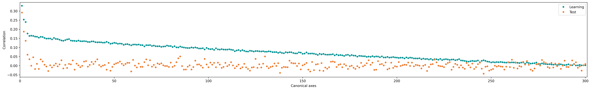
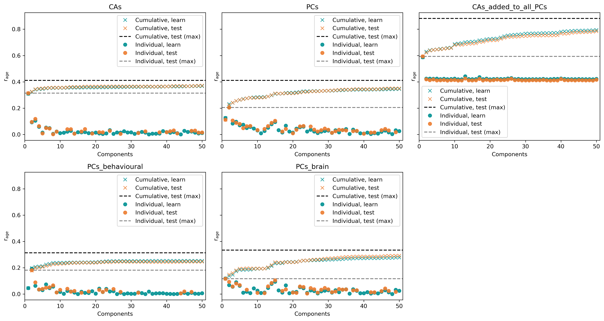
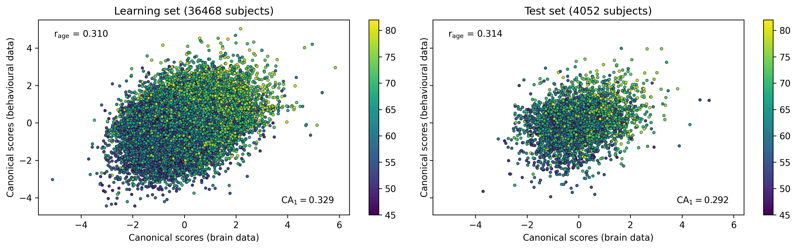

# Results: CCA models with preprocessing within cross-validation loop

*Date: 2022-04-19*

## Summary

### Procedure

- Outer 90/10 split (Learning/Test)
- 50 CV splits:
    - 5-fold CV on Learning set (80/20 Train/Validation)
    - Normalization done inside the CV
- Get 50 x 5 models (include preprocessing, PCA and CCA)
    - Apply each model to full Learning/Test sets --> get CCA scores/projections/factors (`n_subjects` x `n_CAs`, for each of the datasets)
    - Rotate/align factors (to fix sign-flipping/axis reordering)
    - Average factors over all 250 models
- Tried with 25/100/200/300/350/387 PCs for each of brain/behavioural datasets

### Results

- Better results with more PCs (generally)
    - Higher CA1 correlations (on Test set)
        - **25 PCs**: 0.2299
        - **200 PCs**: 0.2684
        - **300 PCs**: 0.2918
        - **350 PCs**: 0.2928
    - Higher correlation between CA1 and age (on Test set)
        - **25 PCs**: 0.2814
        - **200 PCs**: 0.2996
        - **300 PCs**: 0.3138
        - **350 PCs**: 0.2995
    - Steady increase in correlation with age (even on Test set) as more CAs are added
- Age prediction using PCs vs CAs (see plots below for details)
    - No individual PC gives better results than CA1
    - All PCs vs all CAs give virtually the same results
    - Combining all PCs and some/all CAs yields big improvement
        - Ex: correlations with age for 300 PCs (Test set)
            - All 300 CAs: 0.4106
            - All 300 PCs: 0.4108
            - All 300 PCs + CA1: 0.5934
            - All 300 PCs + 300 CAs: 0.8821
        - Effect seems to be there if a large number of PCs is included

## Best results for now: 300 PCs

### Canonical axis correlations

### Linear regression with age

### CA1 and age

